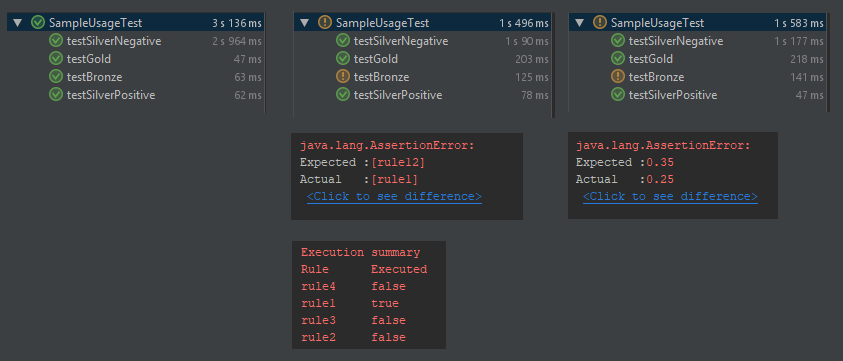

# Camunda Dmn Test Coverage
> An extension to the standard DMN testing framework shipped with the Camunda Engine that allows to gauge coverage of
> decision rules.

[](https://travis-ci.org/AntoCuc/camunda-dmn-test-coverage)

The Camunda Dmn Test Coverage project extends on the standard JUnit-based DmnEngineRule allowing for coverage and rule
matching statistics to be asserted via standard JUnit.
It aims to have a concise API with a shallow learning curve that operates in conjunction with the well established JUnit
testing framework.

Below an example of a successful test run, a mis-matched rule and a coverage assertion error. Notice the
"Execution summary" table logged to better understand which rules have been executed as part of the evaluation.



## Installation

Cross-platform installation of the library can be obtained via maven 3 with the command:

```sh

mvn clean install

```

## Usage example

Importing the library is equivalent to the usual Camunda native DmnEngine rule prepending with the word `Coverage`:

```java

import org.camunda.bpm.dmn.engine.CoverageDmnEngineRule;

```

Initialising the `Rule` consists of:

```java

@Rule public CoverageDmnEngineRule dmnEngineRule = new CoverageDmnEngineRule();

```

And finally, using for assertions:

```java

...
import static org.junit.Assert.assertEquals;
...

//Asserts the rules coverage
assertEquals(0.25, dmnEngineRule.getCoverage(), 0.0);

//Asserts the rules matched (triggered)
assertEquals(singletonList("rule1"), dmnEngineRule.getMatchedRules());

```

It is important to note that the rest of your Unit Tests are not impacted and require no code changes.

There are also some more descriptive assertions shipped with this library. Here is how to use them:

```java

...
import static org.junit.AssertCoverage.assertExactCoverage;
import static org.junit.AssertCoverage.assertRuleMatched;
...

//Asserts the rules coverage is exactly 25%
assertExactCoverage(0.25, dmnEngineRule.getCoverage());
//Asserts the only rule matched (triggered) is "rule4"
assertRuleMatched("rule4", dmnEngineRule.getMatchedRules());

```

_For more examples and usage, please refer to the `SampleUsageTest.java` file in the repository._

## Development setup

To develop and contribute to the library it is necessary to have:

* Oracle or Open JDK version 8 or greater
* Apache Maven version 3
* Git

```sh

make install

```

## Meta

Antonio Cucchiara – GitHub: [AntoCuc](https://github.com/AntoCuc) - Mail: antonio_cuc@yahoo.co.uk

Distributed under the MIT license. See ``LICENSE.md`` for more information.

## Contributing

> Note:
> All code standard checks have been built-in to the install target.
> Please ensure that the build passes on your local (`mvn clean install`) before pushing changes.

How to contribute:

1. Fork it (<https://github.com/AntoCuc/camunda-dmn-test-coverage>)
2. Create your feature branch (`git checkout -b feature/fooBar`)
3. Commit your changes (`git commit -am 'Add some fooBar'`)
4. Push to the branch (`git push origin feature/fooBar`)
5. Create a new Pull Request

## Thanks to

* [Camunda](https://camunda.com)
* [JUnit](https://junit.org/junit4/)

## References

* https://docs.camunda.org/manual/7.9/user-guide/testing/#junit-4
* https://docs.camunda.org/manual/7.9/user-guide/testing/#example-scoping-tests-for-a-java-ee-application
